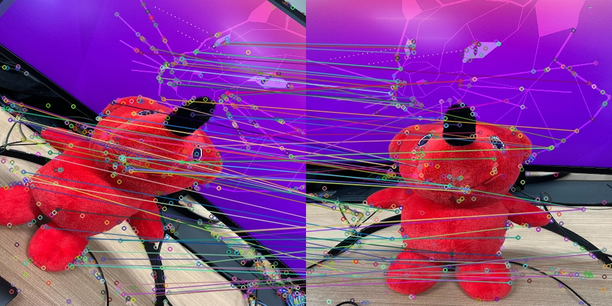
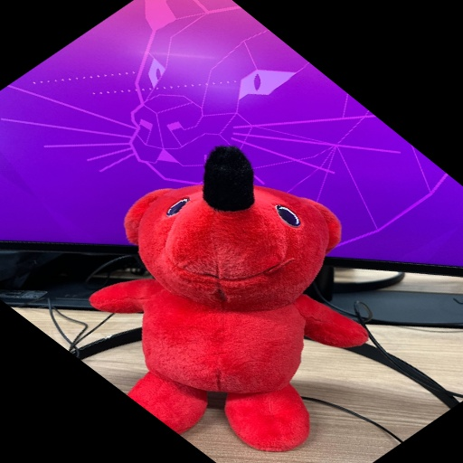

# Homography transform
* opencv 4.0.0で動作確認を行ってます。
1. 2枚の画像から特徴点を抽出
2. 特徴点をマッチング
3. ホモグラフィ変換行列を計算
4. Perspective変換

# build
```bash
$ mkdir build
$ cd build
$ cmake ..
$ make
```

# 使い方
```bash
$ ./main
```

# 結果
### Matching Result

### Transformed Image


# 参考
- [Features2D + Homography to find a known object](https://docs.opencv.org/4.0.0/d7/dff/tutorial_feature_homography.html)
- [Feature Detection and Description](https://docs.opencv.org/4.0.0/d5/d51/group__features2d__main.html)
- [Descriptor Matchers](https://docs.opencv.org/4.0.0/d8/d9b/group__features2d__match.html)